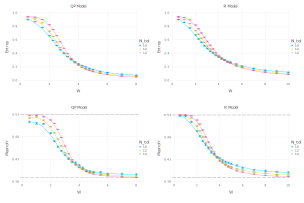

# MBL_ED

[](https://github.com/WeiMXi/MBL_ED.jl/actions)
[](https://codecov.io/gh/WeiMXi/MBL_ED.jl)

## For start, just

```Julia
]add https://github.com/WeiMXi/MBL_ED.jl
using MBL_ED
# ]add JLD, Gadfly, DataFrames, Cairo, Statistics
include("example/run.jl")
include("example/data_process.jl")
```

we can obtain:



## For adjust more parameters, change `example/run.jl`
